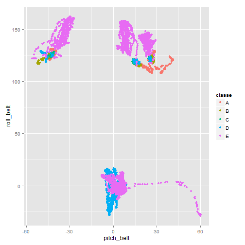
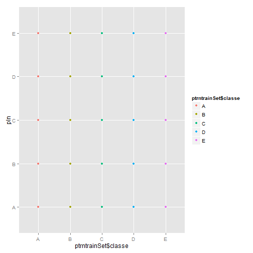
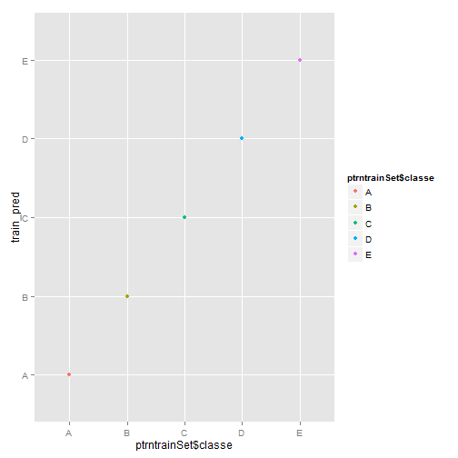
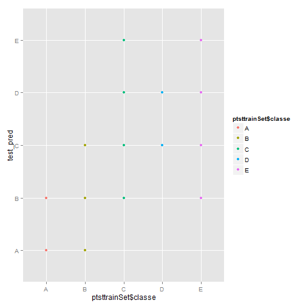

##Data Preparation for the models

####Downloading the data and getting the right library

```r
library(lattice)
library(ggplot2)
library(caret)
library(randomForest)
#Download code commented as one needs to download it only once....
#download.file("https://d396qusza40orc.cloudfront.net/predmachlearn/pml-training.csv","pml-training.csv")
#download.file("https://d396qusza40orc.cloudfront.net/predmachlearn/pml-testing.csv","pml-testing.csv")
trainSet <- read.csv("pml-training.csv",na.strings = c("NA","#DIV/0!"),comment.char="")
testSet <- read.csv("pml-testing.csv",na.strings = c("NA","#DIV/0!"),comment.char="")
```

####Preparing Data Sets both Training And Test


```r
##Preparing Training Data Set
#the list of the columns with the %age of values missing
pcentMiss <- apply(trainSet,2, function(x) sum(is.na(x))/nrow(trainSet))

#number of the columns which have more than 95% values missing 
sum(pcentMiss>.95)
```

```
## [1] 100
```

```r
#removing NA rich columns
NAIndex<-which(pcentMiss>.95)
nntrainSet <- trainSet[,-NAIndex] 
dim(nntrainSet)
```

```
## [1] 19622    60
```

```r
#Removing Index that are not necessary
removeIndex <- grep("timestamp|X|user_name|new_window",names(nntrainSet))
vtrainSet<-nntrainSet[,-removeIndex]
dim(vtrainSet)
```

```
## [1] 19622    54
```

```r
##Preparing Test Data Set similar to train Data Set
nntestSet<-testSet[,-NAIndex]
dim(nntestSet)
```

```
## [1] 20 60
```

```r
vtestSet<-nntestSet[,-removeIndex]
dim(vtestSet)
```

```
## [1] 20 54
```

```r
##The plot for the training set data set
qplot(pitch_belt,roll_belt,data=vtrainSet,col=classe)
```

 

##Modelling the data:

####Partitioning Data Sets


```r
set.seed(1134)
trainingIndex <- createDataPartition(vtrainSet$classe, list = FALSE, p = 0.7)
trntrainSet = vtrainSet[trainingIndex, ]
tsttrainSet = vtrainSet[-trainingIndex, ]
dim(trntrainSet)
```

```
## [1] 13737    54
```

```r
dim(tsttrainSet)
```

```
## [1] 5885   54
```

```r
prop.table(table(trntrainSet$classe))
```

```
## 
##      A      B      C      D      E 
## 0.2843 0.1935 0.1744 0.1639 0.1838
```

```r
prop.table(table(tsttrainSet$classe))
```

```
## 
##      A      B      C      D      E 
## 0.2845 0.1935 0.1743 0.1638 0.1839
```

####Pre Processing all the data sets we have created


```r
num_idx = which(lapply(trntrainSet, class) %in% c("numeric"))
preModel <- preProcess(trntrainSet[,num_idx], method = c("knnImpute"))
ptrntrainSet <- cbind(trntrainSet$classe, predict(preModel, trntrainSet[, num_idx]))
ptsttrainSet <- cbind(tsttrainSet$classe, predict(preModel, tsttrainSet[, num_idx]))
names(ptrntrainSet)[1] <- "classe"
names(ptsttrainSet)[1] <- "classe"
pvtestSet <- predict(preModel, vtestSet[, num_idx])
```

###Linear Model and associated error
Building a linear model with linear discriminant analysis and cross-validation


```r
cvControl <- trainControl(method = "cv", number = 5)
set.seed(3)
linFit <- train(classe~.,data=ptrntrainSet, method="lda", trControl=cvControl)
linFit
```

```
## Linear Discriminant Analysis 
## 
## 13737 samples
##    27 predictors
##     5 classes: 'A', 'B', 'C', 'D', 'E' 
## 
## No pre-processing
## Resampling: Cross-Validated (5 fold) 
## 
## Summary of sample sizes: 10990, 10990, 10991, 10989, 10988 
## 
## Resampling results
## 
##   Accuracy  Kappa  Accuracy SD  Kappa SD
##   0.5       0.4    0.007        0.008   
## 
## 
```

```r
pln<-predict(linFit, newdata=ptrntrainSet)
cln<-confusionMatrix(pln, ptrntrainSet$classe)
cln
```

```
## Confusion Matrix and Statistics
## 
##           Reference
## Prediction    A    B    C    D    E
##          A 2895  716  492  189  348
##          B  289  770  183  356  313
##          C  238  353 1308  300  433
##          D  346  380  179 1075  371
##          E  138  439  234  332 1060
## 
## Overall Statistics
##                                         
##                Accuracy : 0.517         
##                  95% CI : (0.509, 0.526)
##     No Information Rate : 0.284         
##     P-Value [Acc > NIR] : <2e-16        
##                                         
##                   Kappa : 0.386         
##  Mcnemar's Test P-Value : <2e-16        
## 
## Statistics by Class:
## 
##                      Class: A Class: B Class: C Class: D Class: E
## Sensitivity             0.741   0.2897   0.5459   0.4774   0.4198
## Specificity             0.823   0.8970   0.8833   0.8889   0.8981
## Pos Pred Value          0.624   0.4029   0.4970   0.4573   0.4812
## Neg Pred Value          0.889   0.8404   0.9020   0.8966   0.8730
## Prevalence              0.284   0.1935   0.1744   0.1639   0.1838
## Detection Rate          0.211   0.0561   0.0952   0.0783   0.0772
## Detection Prevalence    0.338   0.1391   0.1916   0.1711   0.1604
## Balanced Accuracy       0.782   0.5934   0.7146   0.6831   0.6589
```

```r
#plot for linear model
qplot(ptrntrainSet$classe,pln,col=ptrntrainSet$classe)
```

 

Accuracy through linear model 51.7435%
Sample error48.2565%>.3 and dot plot showing prediction hitting everywhere which means we can do better

###Rainforest Model
Trying a nonlinear model, using training data set within the give pml training set


```r
rf_model <- randomForest(classe ~ ., ptrntrainSet)
```


####training data set accuracy


```r
train_pred<-predict(rf_model,ptrntrainSet)
print(confusionMatrix(train_pred, ptrntrainSet$classe))
```

```
## Confusion Matrix and Statistics
## 
##           Reference
## Prediction    A    B    C    D    E
##          A 3906    0    0    0    0
##          B    0 2658    0    0    0
##          C    0    0 2396    0    0
##          D    0    0    0 2252    0
##          E    0    0    0    0 2525
## 
## Overall Statistics
##                                 
##                Accuracy : 1     
##                  95% CI : (1, 1)
##     No Information Rate : 0.284 
##     P-Value [Acc > NIR] : <2e-16
##                                 
##                   Kappa : 1     
##  Mcnemar's Test P-Value : NA    
## 
## Statistics by Class:
## 
##                      Class: A Class: B Class: C Class: D Class: E
## Sensitivity             1.000    1.000    1.000    1.000    1.000
## Specificity             1.000    1.000    1.000    1.000    1.000
## Pos Pred Value          1.000    1.000    1.000    1.000    1.000
## Neg Pred Value          1.000    1.000    1.000    1.000    1.000
## Prevalence              0.284    0.193    0.174    0.164    0.184
## Detection Rate          0.284    0.193    0.174    0.164    0.184
## Detection Prevalence    0.284    0.193    0.174    0.164    0.184
## Balanced Accuracy       1.000    1.000    1.000    1.000    1.000
```

```r
#plot for training data set accuracy
qplot(ptrntrainSet$classe,train_pred,col=ptrntrainSet$classe)
```

 

Prediction and Actual Values are perfectly lined up in the graph

####test data set accuracy

```r
test_pred<-predict(rf_model,ptsttrainSet)
tm<-confusionMatrix(test_pred, ptsttrainSet$classe)
print(tm)
```

```
## Confusion Matrix and Statistics
## 
##           Reference
## Prediction    A    B    C    D    E
##          A 1670    9    0    0    0
##          B    4 1129    2    0    1
##          C    0    1 1012   10    1
##          D    0    0    9  954    4
##          E    0    0    3    0 1076
## 
## Overall Statistics
##                                        
##                Accuracy : 0.993        
##                  95% CI : (0.99, 0.995)
##     No Information Rate : 0.284        
##     P-Value [Acc > NIR] : <2e-16       
##                                        
##                   Kappa : 0.991        
##  Mcnemar's Test P-Value : NA           
## 
## Statistics by Class:
## 
##                      Class: A Class: B Class: C Class: D Class: E
## Sensitivity             0.998    0.991    0.986    0.990    0.994
## Specificity             0.998    0.999    0.998    0.997    0.999
## Pos Pred Value          0.995    0.994    0.988    0.987    0.997
## Neg Pred Value          0.999    0.998    0.997    0.998    0.999
## Prevalence              0.284    0.194    0.174    0.164    0.184
## Detection Rate          0.284    0.192    0.172    0.162    0.183
## Detection Prevalence    0.285    0.193    0.174    0.164    0.183
## Balanced Accuracy       0.998    0.995    0.992    0.993    0.997
```

```r
#plot for test data set accuracy
qplot(ptsttrainSet$classe,test_pred,col=ptsttrainSet$classe)
```

 

Accuracy through test data set 99.2523% which means it is good model!!

well graph is showing some dots away from the actual values, but as we can see from confusion matrix only few values are deviating.

##Test Set Prediction Results
Using the Random Forest Model to predict the values for the requested test cases


```r
answers<-predict(rf_model,pvtestSet)
answers
```

```
##  1  2  3  4  5  6  7  8  9 10 11 12 13 14 15 16 17 18 19 20 
##  B  A  B  A  A  E  D  B  A  A  B  C  B  A  E  E  A  B  B  B 
## Levels: A B C D E
```

###Writing output files
Print out the submission file


```r
pml_write_files = function(x) {
    n = length(x)
    for (i in 1:n) {
        filename = paste0("problem_id_", i, ".txt")
        write.table(x[i], file = filename, quote = FALSE, row.names = FALSE, 
            col.names = FALSE)
    }
}
pml_write_files(answers)
```
